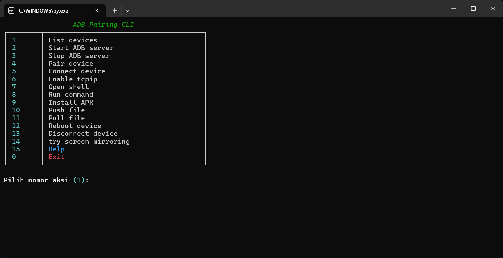

# ADB Pairing CLI (`adb.py`)

`adb.py` adalah **CLI (Command Line Interface)** berbasis Python untuk mengelola dan mengontrol perangkat Android melalui **ADB (Android Debug Bridge)**.  
Script ini bersifat **cross-platform** (Windows, Linux, macOS) dan dilengkapi dengan menu interaktif menggunakan **Rich library** agar tampilan lebih user-friendly.

---

## ✨ Fitur Utama

1. **List devices** – Menampilkan daftar perangkat yang terhubung (`adb devices -l`).
2. **Start ADB server** – Menjalankan ADB server.
3. **Stop ADB server** – Mematikan ADB server.
4. **Pair device** – Pairing perangkat menggunakan `ip:port` dan PIN, lalu otomatis mencoba connect ke port 5555.
5. **Connect device** – Menghubungkan perangkat ke host/IP tertentu.
6. **Enable tcpip** – Mengaktifkan mode `tcpip` di port tertentu (default: 5555).
7. **Open shell** – Membuka shell interaktif di perangkat.
8. **Run command** – Menjalankan perintah shell langsung di perangkat.
9. **Install APK** – Menginstal file APK ke perangkat.
10. **Push file** – Mengirim file dari PC ke perangkat.
11. **Pull file** – Mengambil file dari perangkat ke PC.
12. **Reboot** – Merestart perangkat (normal/bootloader/recovery).
13. **Disconnect** – Memutuskan koneksi dari perangkat.
14. **Screen mirroring** – Menjalankan `scrcpy` untuk mirror layar Android ke PC.
15. **Help** – Menampilkan panduan perintah dan penggunaan.
0. **Exit** – Keluar dari aplikasi CLI.

---

## ⚙️ Dependensi

- Python 3
- [ADB (Android Debug Bridge)](https://developer.android.com/studio/releases/platform-tools)
- [Rich](https://pypi.org/project/rich/) (untuk tampilan CLI yang lebih baik)
- Opsional: [scrcpy](https://github.com/Genymobile/scrcpy) (untuk fitur mirroring)

---

## 📂 Struktur Utama Kode

- **Utility**
  - `run_adb()` → Menjalankan perintah ADB dan menangkap output.
  - `which_adb()` → Mendeteksi lokasi ADB di sistem.
  - `ensure_adb()` → Memastikan ADB tersedia.
  - `get_os_tag()` → Deteksi OS (Windows, Linux, macOS).

- **ADB Actions**
  - Fungsi untuk operasi ADB (pair, connect, shell, push, pull, reboot, dll).

- **Scrcpy Helper**
  - `ensure_scrcpy()` → Mengecek/mengunduh scrcpy sesuai OS.
  - `try_screen_mirroring()` → Menjalankan scrcpy bila perangkat tersedia.

- **Menu & Main Loop**
  - `show_menu()` → Menampilkan menu interaktif.
  - `main_loop()` → Loop utama CLI untuk menangani input user.

---

## 🚀 Cara Menjalankan

```bash
python adb.py



